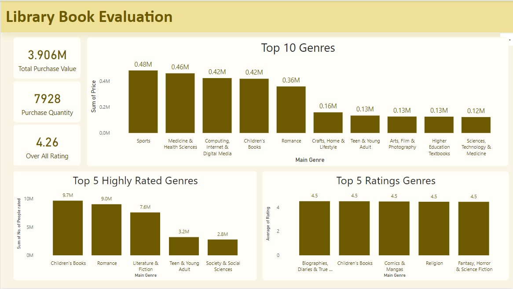
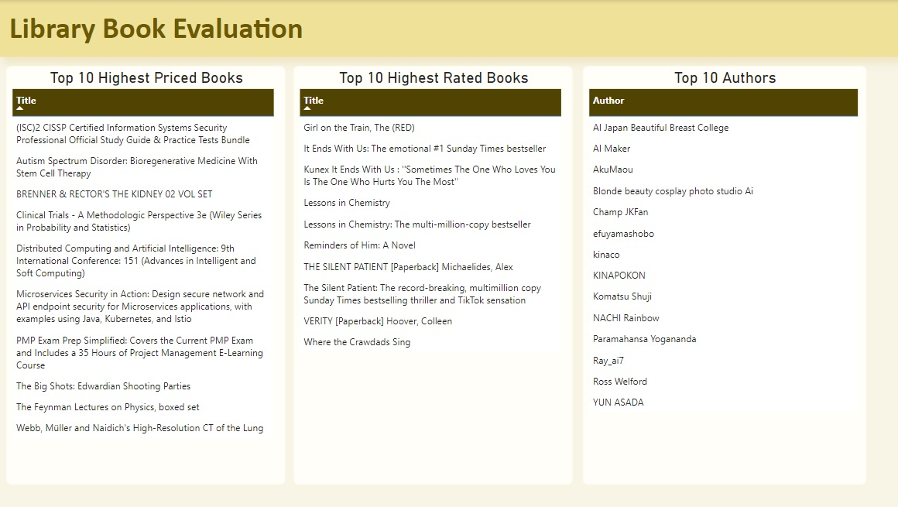
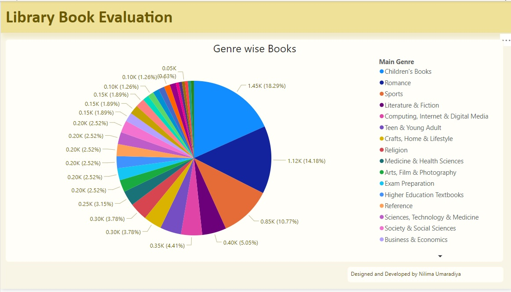

## Project Objective
In this project, we analyze a dataset that contains information about a library’s book collection. The main aim of this project is to perform descriptive and statistical analysis to gain insights into various aspects of the library’s books. The analysis will help in identifying trends, evaluating book usage, and supporting decisions on resource management, acquisitions, and library services.

## Dataset
The dataset includes information such as:

Book title and author
Genre or category
Average rating
Checkout frequency
Availability and stock levels
Number of reviews and ratings

##Library Analysis
This dataset helps us understand the library's collection and performance. We will perform various analyses to:
Identify the most popular genres and books.
Assess the overall library rating.
Find books that are most frequently checked out.
Analyze the condition of books and identify the need for replacements or repairs.
Evaluate the average rating for books across different categories.

## Dashboard
An interactive dashboard will be developed to display the findings. The dashboard will include:
-Total number of books in different genres or categories.
-Books with the highest number of checkouts.
-Books with the highest ratings.
-Condition tracking to identify books that need repair or replacement.
-Top authors based on ratings and reviews.
-Recommendations for future acquisitions based on popularity trends.

## Conclusion
This project provides valuable insights into the library's collection, including:
-Popular genres and books: Helps identify what readers are most interested in.
-Condition assessment: Identifies books that need repair or replacement.
-Checkout frequency: Provides insights into the most in-demand books.
-Rating analysis: Helps assess the quality of books across different categories.
-Based on the insights gained, the library can improve its collection by:
-Focusing on acquiring more books in popular genres.
-Replacing or repairing books that are in poor condition.
-Promoting highly-rated or frequently checked-out books to enhance user experience.
-The dashboard allows library staff and users to filter books based on factors like rating, genre, condition, and checkout frequency, helping patrons make more informed decisions when choosing books.
